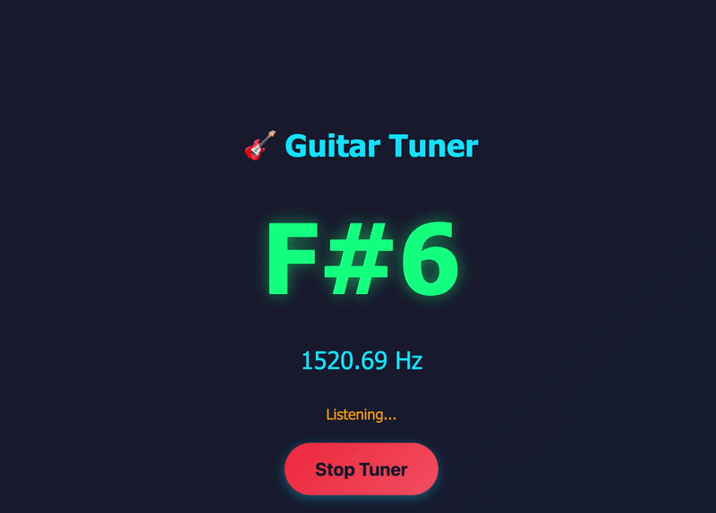

# 🎸 Free Guitar Tuner

A high-quality, browser-based guitar tuner built as a single HTML file. No installation required, works offline, and provides accurate pitch detection using advanced audio processing algorithms.

## 🎬 Demo



*Watch the tuner in action - real-time pitch detection and note display*

## ✨ Features

- **Zero Installation**: Works directly in your browser - no apps, no downloads
- **Offline Support**: Progressive Web App (PWA) capabilities for offline use
- **Real-time Detection**: Instant pitch detection with visual feedback
- **High Accuracy**: Advanced autocorrelation algorithm for precise frequency detection
- **Standard Tuning**: Optimized for standard guitar tuning (E2, A2, D3, G3, B3, E4)
- **Clean UI**: Modern, responsive design that works on desktop and mobile
- **Single File**: Everything contained in one HTML file for maximum portability

## 🚀 How to Use

### For End Users

1. **Open the Tuner**
   - Visit the hosted version or open `index.html` in any modern browser
   - Works on Chrome, Firefox, Safari, and Edge

2. **Grant Microphone Access**
   - Click the "Start Tuner" button
   - Allow microphone access when prompted by your browser

3. **Tune Your Guitar**
   - Play a string on your guitar
   - The tuner will display:
     - **Note name** (e.g., E4, A2) in large text
     - **Frequency** in Hz
     - **Tuning status** (Sharp, Flat, or In Tune)
   - Adjust your string until you see "In Tune! ✓"

4. **Tips for Best Results**
   - Play one string at a time
   - Pluck the string clearly and let it ring
   - Position your device close to the guitar
   - Use in a quiet environment for best accuracy

5. **Stop the Tuner**
   - Click "Stop Tuner" when finished
   - This releases the microphone access

### Install as PWA (Optional)

On mobile devices or desktop browsers, you can install this as a Progressive Web App:

- **Chrome/Edge**: Click the install icon in the address bar
- **Safari (iOS)**: Tap Share → Add to Home Screen
- **Android**: Tap the menu → Install App

Once installed, the tuner works offline and launches like a native app!

## 🛠️ Technologies Used

### Core Web APIs

- **Web Audio API**: Powers the entire audio processing pipeline
  - `AudioContext`: Manages audio processing graph
  - `MediaStreamSource`: Captures microphone input
  - `AnalyserNode`: Provides time-domain audio data
  - `ScriptProcessor`: Processes audio in real-time chunks

- **MediaDevices API**: Accesses user's microphone
  - `getUserMedia()`: Requests microphone permissions and stream

### Audio Processing Algorithm

- **Autocorrelation**: Advanced pitch detection algorithm
  - Analyzes waveform patterns to detect fundamental frequency
  - Filters out noise with RMS threshold (0.01)
  - Uses correlation threshold (0.9) for accurate peak detection
  - Sample rate: 4096 samples per analysis
  - Frequency range: ~20 Hz to ~2000 Hz

- **Frequency to Note Conversion**
  - Based on equal temperament tuning (A4 = 440 Hz)
  - Logarithmic scale calculation for precise note detection
  - Covers full chromatic scale with octave detection

### User Experience Features

- **Hold Mechanism**: Displays detected note for 2 seconds
  - Prevents flickering during string vibration
  - Provides stable visual feedback

- **Tuning Tolerance**: ±2 Hz accuracy window
  - "In Tune" when within 2 Hz of target frequency
  - "Sharp" or "Flat" indicators for guidance

### Progressive Web App (PWA)

- **Service Worker**: Enables offline functionality
  - Caches the HTML file for offline access
  - Provides app-like experience

- **Web App Manifest**: Defines app metadata
  - Custom icon and theme colors
  - Standalone display mode
  - Installable on home screen

### Design & Styling

- **Pure CSS**: No external frameworks
  - Gradient backgrounds for modern look
  - Responsive flexbox layout
  - Smooth animations and transitions
  - Mobile-first responsive design

- **Visual Feedback**
  - Color-coded note display (green glow)
  - Frequency display in cyan
  - Status messages in orange
  - Button state changes (gradient shift)

## 👨‍💻 For Developers

### Contributing

We welcome contributions! Here's how you can help:

1. **Fork the Repository**
   ```bash
   git clone https://github.com/pdan/free-guitar-tuner.git
   cd free-guitar-tuner
   ```

2. **Make Your Changes**
   - Edit `index.html` - it's all in one file!
   - Test in multiple browsers (Chrome, Firefox, Safari)
   - Ensure mobile responsiveness

3. **Test Thoroughly**
   - Test with real guitar input
   - Verify microphone permissions work
   - Check offline PWA functionality
   - Test on different devices

4. **Submit a Pull Request**
   - Describe your changes clearly
   - Include screenshots/videos if UI changes
   - Reference any related issues

### Development Ideas

- [ ] Add support for alternate tunings (Drop D, DADGAD, etc.)
- [ ] Visual tuning meter/gauge
- [ ] Chromatic mode for other instruments
- [ ] Dark/light theme toggle
- [ ] Tuning history/log
- [ ] Sound output for reference tones
- [ ] Calibration settings (A4 = 440 Hz adjustment)

### Project Structure

```
free-guitar-tuner/
├── index.html          # Main application (HTML + CSS + JavaScript)
├── manifest.json       # PWA manifest (referenced but not included)
├── sw.js              # Service worker (referenced but not included)
└── README.md          # This file
```

**Note**: The current implementation references `manifest.json` and `sw.js` but they're not included in the repository. The tuner works without them, but adding these files would enable full PWA functionality.

### Key Code Sections

- **Lines 1-100**: HTML structure and CSS styling
- **Lines 101-150**: Audio context setup and microphone access
- **Lines 151-200**: Autocorrelation pitch detection algorithm
- **Lines 201-250**: Note detection and display logic
- **Lines 251-280**: Service worker registration

### Browser Compatibility

- ✅ Chrome 74+
- ✅ Firefox 70+
- ✅ Safari 14.1+
- ✅ Edge 79+
- ⚠️ Requires HTTPS (or localhost) for microphone access

## 📝 License

This project is open source and available for free use.

## 🤝 Support

If you find this tuner helpful:
- ⭐ Star this repository
- 🐛 Report bugs via Issues
- 💡 Suggest features via Issues
- 🔀 Submit pull requests

## 🎵 Happy Tuning!

Made with ❤️ for guitarists everywhere
